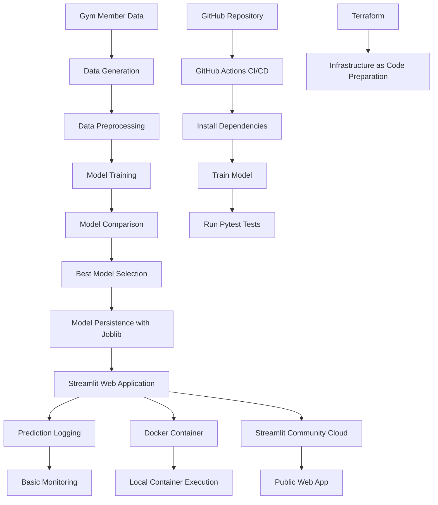

# FitRetention - Project Report

## 1. Introduction

FitRetention is a Machine Learning Operations project focused on predicting gym member churn.

The objective is to build an end-to-end Machine Learning web application that helps a fitness center identify members who may cancel their subscription. The project combines Machine Learning, software engineering and MLOps practices to create a reproducible and deployable application.

The final application is available online at:

```text
https://fitretention-gym-churn.streamlit.app
```

---

## 2. Business Context

Customer churn is a relevant business problem for gyms and fitness centers. Losing members directly affects recurring revenue and business stability.

Members may cancel their subscription because of:

- low attendance,
- low satisfaction,
- lack of engagement,
- high monthly fees,
- long periods without visiting the gym,
- lack of personalized support.

FitRetention helps detect these cases early. Instead of reacting after a member cancels, the gym can act proactively by contacting the member or offering a personalized retention strategy.

---

## 3. Project Objective

The main objective of the project is to create a complete MLOps workflow around a Machine Learning model.

The project aims to:

- generate and prepare data,
- train a Machine Learning model,
- compare multiple candidate models,
- select the best model automatically,
- expose the model through a web application,
- containerize the application with Docker,
- automate testing with GitHub Actions,
- deploy the application to the cloud,
- prepare infrastructure-as-code with Terraform,
- include basic prediction monitoring.

---

## 4. Application Description

FitRetention is developed as a Streamlit web application.

The app contains the following sections:

### Home

Introduces the business problem, project value and technology stack.

### Prediction

Allows the user to enter information about a gym member and receive:

- churn probability,
- risk level,
- final prediction,
- recommended retention action.

### Data Insights

Shows information about the dataset, including:

- dataset preview,
- churn rate,
- churn distribution,
- average satisfaction by churn status,
- average behavior comparison.

### Model Performance

Displays the Machine Learning results:

- selected best model,
- accuracy,
- precision,
- recall,
- F1-score,
- model comparison,
- feature importance.

### Prediction Monitoring

Stores and displays predictions made through the application.

This provides a basic monitoring mechanism and supports traceability.

### MLOps Pipeline

Explains the technical workflow implemented in the project.

---

## 5. Dataset

The project uses a synthetic dataset that simulates realistic gym member behavior.

The dataset contains the following variables:

| Feature | Description |
|---|---|
| age | Age of the gym member |
| membership_months | Number of months since the member joined |
| weekly_visits | Average number of weekly gym visits |
| days_since_last_visit | Number of days since the last visit |
| monthly_fee | Monthly membership fee |
| satisfaction_score | Satisfaction level from 1 to 10 |
| personal_trainer | Whether the member uses a personal trainer |
| group_classes | Whether the member attends group classes |
| membership_type | Type of membership |
| churn | Target variable indicating cancellation |

Synthetic data is used because real gym membership data may contain sensitive personal information and is usually protected by privacy regulations.

---

## 6. Machine Learning Methodology

The project treats churn prediction as a binary classification problem.

The target variable is:

```text
churn
```

where:

- `0` means the member does not churn,
- `1` means the member churns.

The following models are trained and compared:

- Logistic Regression,
- Random Forest,
- Gradient Boosting.

The model selection criterion is the F1-score.

The F1-score is used because churn prediction requires balancing:

- precision: how many predicted churn cases are actually churn,
- recall: how many real churn cases are detected.

This is important because missing a high-risk member may represent a lost customer, while incorrectly flagging a member may lead to unnecessary retention actions.

---

## 7. Model Selection

After training the candidate models, the system automatically selects the model with the highest F1-score.

The selected model is saved using Joblib and used by the Streamlit application for prediction.

The following files are generated during training:

```text
models/churn_model.pkl
models/model_metrics.pkl
models/model_comparison.csv
models/best_model_name.pkl
models/feature_importance.csv
```

This approach makes the project more reproducible and allows future improvements by adding more models to the comparison.

---

## 8. MLOps Workflow

The project follows an end-to-end MLOps workflow.

### System Architecture Diagram



### Architecture Explanation

The project starts with synthetic gym member data generation and preprocessing. Multiple Machine Learning models are trained and compared, and the best model is selected based on the F1-score. The selected model is saved with Joblib and used by the Streamlit web application.

The application logs predictions to support basic monitoring and traceability. GitHub Actions provides CI/CD automation by installing dependencies, training the model and running tests on each push. Docker provides a reproducible containerized execution environment, while Streamlit Community Cloud provides public cloud access to the application. Terraform is included as the infrastructure-as-code component for future cloud infrastructure expansion.

### Workflow Summary

```text
Data generation
      ↓
Data preprocessing
      ↓
Model training
      ↓
Model comparison
      ↓
Best model selection
      ↓
Model persistence
      ↓
Streamlit web application
      ↓
Prediction logging
      ↓
Testing
      ↓
CI/CD automation
      ↓
Docker containerization
      ↓
Cloud deployment
      ↓
Infrastructure-as-code preparation
```

This workflow demonstrates how a Machine Learning model can be transformed into a usable, reproducible and deployable application.

---

## 9. Software Engineering Practices

The project includes several software engineering practices.

### Version Control

The project is stored in GitHub and uses Git for version control.

### Modular Structure

The project is organized into folders:

```text
app/
src/
models/
data/
tests/
terraform/
.github/workflows/
.streamlit/
```

### Testing

Pytest is used to validate the prediction function.

### CI/CD

GitHub Actions automatically runs the pipeline when changes are pushed to the repository.

### Containerization

Docker is used to package the application and its dependencies.

### Cloud Deployment

The application is deployed using Streamlit Community Cloud.

---

## 10. CI/CD Pipeline

The CI/CD pipeline is implemented with GitHub Actions.

The workflow performs these steps:

1. checkout the repository,
2. set up Python,
3. install dependencies,
4. train the model,
5. run tests.

This ensures that every new version of the project is automatically validated.

A successful pipeline indicates that the application can be built, trained and tested correctly.

---

## 11. Docker

Docker is used to create a reproducible execution environment.

The Docker image contains:

- Python,
- project dependencies,
- application code,
- model training process,
- Streamlit startup command.

The app can be executed with:

```bash
docker build -t fitretention .
docker run -p 8501:8501 fitretention
```

This demonstrates that the project is not dependent on a specific local environment.

---

## 12. Cloud Deployment

The application is deployed on Streamlit Community Cloud.

Public URL:

```text
https://fitretention-gym-churn.streamlit.app
```

This allows users to access the application from a browser without installing Python, dependencies or Docker.

The deployment is connected to the GitHub repository, so updates can be deployed from the main branch.

---

## 13. Monitoring

The project includes basic prediction logging.

Each prediction stores:

- timestamp,
- input values,
- churn probability,
- risk level,
- recommended action.

The logs are stored in:

```text
logs/predictions_log.csv
```

This is not full production monitoring, but it is a first step toward traceability and observability.

In a production system, this could be extended with:

- dashboards,
- alerting,
- model drift detection,
- data drift detection,
- scheduled retraining.

---

## 14. Infrastructure as Code

Terraform is included as the infrastructure-as-code component of the project.

The current Terraform configuration is a starting point that can be extended to provision cloud resources such as:

- resource groups,
- container registries,
- app services,
- storage accounts,
- monitoring resources.

This demonstrates how the project could be moved toward a more advanced cloud deployment setup.

---

## 15. User Interface and Visual Design

The application uses a custom dark interface to create a more professional user experience.

The interface includes:

- a custom sidebar navigation system,
- dark theme styling,
- visual cards,
- interactive Plotly charts,
- clear metric sections,
- risk-level feedback cards,
- a consistent green accent color.

The goal of the design is to make the application look like a real business tool rather than a simple prototype.

---

## 16. Limitations

The main limitations of the project are:

- the dataset is synthetic,
- the model is not trained on real production data,
- monitoring is basic,
- there is no authentication system,
- there is no automated retraining schedule,
- Terraform is prepared as a starting point but not connected to a full production deployment.

These limitations are acceptable for an academic project, but they should be addressed before using the application in a real business environment.

---

## 17. Future Improvements

Future improvements could include:

- using a real gym membership dataset,
- adding user authentication,
- deploying the Docker container to Azure,
- improving Terraform infrastructure,
- adding model drift detection,
- adding automated retraining,
- adding advanced monitoring dashboards,
- storing prediction logs in a database,
- adding explainability tools such as SHAP,
- adding an admin dashboard for gym managers.

---

## 18. Conclusion

FitRetention demonstrates how Machine Learning can be combined with MLOps practices to create a complete web application.

The project goes beyond model training by including:

- a professional web interface,
- automated model comparison,
- interactive visual analytics,
- Docker containerization,
- CI/CD automation,
- cloud deployment,
- prediction logging,
- infrastructure-as-code preparation.

This makes the project a complete academic example of how to move from a Machine Learning model to a deployed and maintainable application.